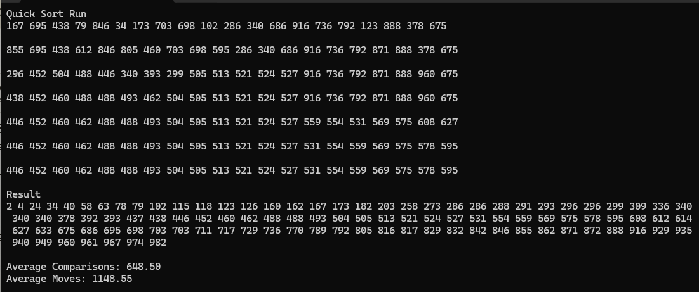

## result (보너스)

## 🔍 정렬 알고리즘 성능

| 알고리즘     | 평균 시간 복잡도 | 최선의 경우 | 최악의 경우 | 공간 복잡도 | 안정성 |
|--------------|------------------|-------------|-------------|-------------|--------|
| 버블 정렬    | O(n²)            | O(n)        | O(n²)       | O(1)        | ✅ 안정   |
| 선택 정렬    | O(n²)            | O(n²)       | O(n²)       | O(1)        | ❌ 불안정 |
| 삽입 정렬    | O(n²)            | O(n)        | O(n²)       | O(1)        | ✅ 안정   |
| 쉘 정렬      | O(n log n)       | O(n log n)  | O(n²)       | O(1)        | ❌ 불안정 |
| 합병 정렬    | O(n log n)       | O(n log n)  | O(n log n)  | O(n)        | ✅ 안정   |
| 퀵 정렬      | O(n log n)       | O(n log n)  | O(n²)       | O(log n)    | ❌ 불안정 |

### 💡 각 알고리즘의 특징

- **버블 정렬**: 가장 단순하지만 비효율적인 알고리즘
- **선택 정렬**: 배열에서 최소/최대값을 찾아 정렬
- **삽입 정렬**: 작은 데이터나 대부분 정렬된 데이터에 효과적
- **쉘 정렬**: 삽입 정렬의 개선된 버전
- **합병 정렬**: 분할 정복 알고리즘, 안정적인 성능
- **퀵 정렬**: 평균적으로 가장 빠른 정렬 알고리즘

### 📊 퀵 정렬 분석

- 비교 횟수 : 평균 633회
- 이동 횟수 : 평균 1154회

장점
- 평균 시간 복잡도 O(n log n)
- 대부분의 실제 상황에서 가장 빠른 정렬 알고리즘
- 메모리 사용이 적음

단점
-최악의 경우 O(n²) 시간 복잡도
- 불안정 정렬 (동일 값의 상대적 위치 보장 X)
- 피벗 선택에 따라 성능 크게 좌우
  
