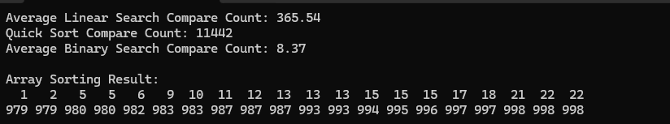
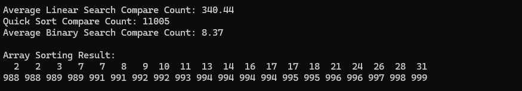
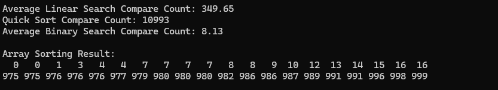

## result1


## result2


## result3

 

### 🔍 탐색 알고리즘 비교

| 탐색 방법    | 평균 비교 횟수 | 특징 |
|--------------|----------------|------|
| 순차 탐색    | ~500 | 모든 요소를 순차적으로 검색 |
| 이진 탐색    | ~10  | 정렬된 배열에서 절반씩 제거하며 검색 |


### 1. 순차 탐색 
- 작동 방식: 배열의 첫 요소부터 마지막 요소까지 순차적으로 탐색
- 시간 복잡도: O(n)
- 특징: 
  - 정렬되지 않은 배열에서도 사용 가능
  - 최악의 경우 모든 요소를 확인해야 함

### 2. 이진 탐색 
- 작동 방식: 정렬된 배열의 중간값을 기준으로 탐색 범위를 절반으로 축소
- 시간 복잡도: O(log n)
- 특징:
  - 반드시 정렬된 배열에서만 사용 가능
  - 탐색 범위를 기하급수적으로 줄임

## 🚀 성능 차이

### 왜 이진 탐색이 순차 탐색보다 빠른 이유

1. **공간 분할 원리**
   - 순차 탐색: 한 번에 1개 요소 제거
   - 이진 탐색: 한 번에 절반의 요소 제거

2. **탐색 공간 축소**
   ```
   1000개 데이터 기준
   - 순차 탐색: 평균 500회 비교
   - 이진 탐색: 평균 10회 비교
   ```

3. **로그함수의 힘**
   - log₂(1000) ≈ 10
   - 데이터가 커질수록 이진 탐색의 장점은 더 커짐

#### 순차 탐색
```
[찾기] 42를 [10, 35, 42, 50, 75, 100, 200] 에서 찾기
1. 10 
2. 35 
3. 42 ✅ (3번 만에 찾음)
```

#### 이진 탐색
```
[찾기] 42를 [10, 35, 42, 50, 75, 100, 200] 에서 찾기
1. 중간값(50) > 찾는 값(42) ➡ 왼쪽 절반 탐색
2. 중간값(35) < 찾는 값(42) ➡ 오른쪽 절반 탐색
3. 42 ✅ (2번 만에 찾음)
```

## 🎯 결론

1. 퀵 정렬은 이진 탐색의 필수 전제 조건
2. 대규모 데이터에서 이진 탐색의 성능 우위 확연
3. 정렬 비용 대비 탐색 효율성 극대화

