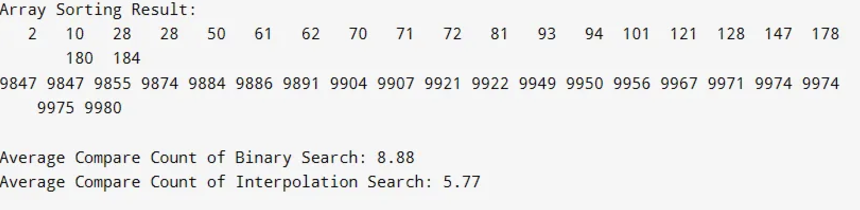

## result1

## result2

## result3

### 1. 이진 검색 (Binary Search)
- **시간 복잡도**: O(log n)
- **특징**:
  - 정렬된 데이터에서 매우 효율적
  - 탐색 범위를 절반씩 줄여나가며 검색
- **장점**:
  - 대규모 데이터셋에서 빠른 검색 속도
  - 메모리 사용 효율성

### 2. 보간 검색 (Interpolation Search)
- **시간 복잡도**: 
  - 평균: O(log(log n))
  - 최악: O(n)
- **특징**:
  - 균등 분포된 데이터에 최적화
  - 값의 위치를 예측하여 검색 위치 추정

## 🚀 성능 분석

### 정렬의 중요성
- **정렬되지 않은 데이터**: 순차 검색 O(n)
- **정렬된 데이터**: 이진/보간 검색 O(log n)

### 검색 알고리즘 비교

| 알고리즘 | 시간 복잡도 | 공간 복잡도 | 데이터 요구사항 |
|----------|-------------|--------------|-----------------|
| 순차 검색 | O(n) | O(1) | 정렬 불필요 |
| 이진 검색 | O(log n) | O(1) | 정렬 필요 |
| 보간 검색 | O(log(log n)) | O(1) | 정렬 및 균등 분포 필요 |

## 🔬 실험 결과 해석

### 비교 횟수 감소 원인
1. **로그 복잡도의 이점**
   - 각 반복마다 검색 공간을 절반으로 축소
   - 데이터 크기에 비해 현저히 적은 비교 횟수

2. **분할 정복 전략**
   - 중간값을 기준으로 한 효율적인 데이터 분할
   - 불필요한 요소들을 빠르게 제거

## 결론
정렬된 데이터에서의 이진 및 보간 검색은 순차 검색에 비해 현저히 높은 성능을 보입니다.

