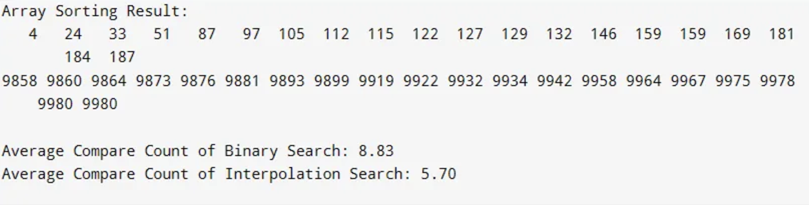

## result1

## result2

## result3


### Binary Search의 접근 방식
- 항상 중간 지점을 계산하여 검색 범위를 균등하게 반으로 분할
- 정렬된 리스트에서 균일한 분포를 가정
- 최악의 경우 O(log n) 시간 복잡도

### Interpolation Search의 접근 방식
- 데이터의 실제 분포를 고려하여 검색 위치를 추정
- 데이터가 균일하게 분포된 경우 더 빠른 검색 가능
- 최선의 경우 O(log(log n)), 최악의 경우 O(n)

## 비교 예시

### 균일한 분포의 데이터
```
배열: [10, 20, 30, 40, 50, 60, 70, 80, 90, 100]
찾을 값: 60

Binary Search: 
1. mid = 5 (중간 인덱스)
2. 60과 비교
3. 정확히 3번의 비교로 찾음

Interpolation Search:
1. 60의 위치를 정확히 예측
2. 바로 목표 값에 도달
3. 단 1번의 비교로 찾음
```

### 비균일한 분포의 데이터
```
배열: [10, 20, 30, 100, 200, 1000, 10000]
찾을 값: 100

Binary Search:
1. 항상 중간 지점 계산
2. 3-4번의 비교 필요

Interpolation Search:
1. 100의 상대적 위치를 더 정확히 추정
2. 바로 근접한 위치로 이동
3. 비교 횟수 최소화
```


## 정리
Interpolation Search는 데이터 분포가 고르게 되어 있는 경우 Binary Search보다 더 적은 비교로 값을 찾을 가능성이 높다. 이는 탐색 위치를 단순히 중앙이 아닌, 탐색 대상 값의 추정 위치로 선택하기 때문이다.
다만, 데이터 분포가 불균일한 경우 Binary Search보다 성능이 떨어질 수는 있다.


