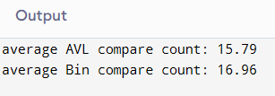
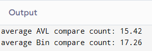
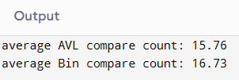

## result1

## result2

## result3

### AVL 트리와 이진 탐색 트리(BST) 성능 비교

## 결과 분석
1. AVL 트리
AVL 트리는 자가 균형 이진 탐색 트리로, 삽입 및 삭제 후 트리의 균형을 유지합니다. 이를 통해 고르게 분포된 높이를 유지하며, 최악의 경우에도 높이가 O(logn)입니다.
따라서, AVL 트리는 탐색 시 평균적으로 적은 비교 횟수를 기록하였습니다. 이는 AVL 트리가 항상 균형을 유지하기 때문에, 탐색 시 더 적은 노드를 방문하게 되기 때문입니다.

3. 이진 탐색 트리
일반 이진 탐색 트리는 삽입과 삭제 후 균형을 유지하지 않으므로, 특정 경우에는 비효율적인 구조가 될 수 있습니다. 예를 들어, 연속된 정수를 삽입할 경우, 트리가 편향되어 최악의 경우 높이가  O(n)에 이를 수 있습니다.
이로 인해 이진 탐색 트리는 AVL 트리에 비해 평균적으로 더 많은 비교 횟수를 필요로 하였습니다.

## 결론
AVL 트리는 이진 탐색 트리보다 평균적으로 탐색 효율이 높다는 결과를 확인할 수 있었습니다. 따라서, 많은 데이터를 다루거나 빈번한 삽입 및 삭제 작업이 있는 경우, AVL 트리와 같은 자가 균형 트리 구조를 사용하는 것이 유리하다고 생각합니다.
